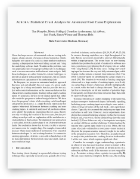

# Aurora: Statistical Crash Analysis for Automated Root Cause Explanation
<a href="https://www.usenix.org/conference/usenixsecurity20/presentation/blazytko">  </a>

Aurora is a tool for automated root cause analysis. It is based on our [paper](https://www.usenix.org/system/files/sec20-blazytko.pdf) ([slides](https://www.usenix.org/system/files/sec20_slides_blazytko.pdf), [recording](https://2459d6dc103cb5933875-c0245c5c937c5dedcca3f1764ecc9b2f.ssl.cf2.rackcdn.com/sec20/videos/0812/s3_software_security_and_verification/4_sec20fall-paper610-presentation-video.mp4)):

```
@inproceedings{blazytko2020aurora,
    author = {Tim Blazytko and Moritz Schl{\"o}gel and Cornelius Aschermann and Ali Abbasi and Joel Frank and Simon W{\"o}rner and Thorsten Holz},
    title = {{AURORA}: Statistical Crash Analysis for Automated Root Cause Explanation},
    year = {2020},
    booktitle =  {29th {USENIX} Security Symposium ({USENIX} Security 20)},
}
```


# Components

This repository is structured as follows:

1) Crash exploration (AFL): Our patch for AFL's crash exploration mode.

2) Tracer (Pin): Our tracer to extract information such as register values for inputs.

3) Root Cause Analysis: Our Rust-based tooling to identify the root cause.


## Crash Exploration

We rely on AFL's crash exploration mode. We patch AFL such that inputs not crashing anymore (so-called non-crashes) are saved. Download AFL 2.52b and apply our patch `patch -p1 < crash_exploration.patch` before running AFL's crash exploration mode as usual.


## Tracer
 
Our tracer is implemented as a pintool. Install Pin 3.15 and then compile our tool with `make obj-intel64/aurora_tracer.so`. We provide scripts to trace one input (tracing/scripts/run_tracer.sh) or multiple inputs (tracing/scripts/tracing.py).

## Root Cause Analysis

Our RCA component is written in Rust. It expects an evaluation folder (organized as in our example folder) and a folder containing traces.

The tool `rca` performs the predicate analysis, monitoring and ranking; `addr2line` enriches the predicates with debug symbols (if existing).

```
# build project
cargo build --release

# run root cause analysis
cargo run --release --bin rca -- --eval-dir <path to eval dir> --trace-dir <path to trace dir> --monitor --rank-predicates

# enrich with debug symbols
cargo run --release --bin addr2line -- --eval-dir <path to eval dir>
```

# Example

The following commands show how to use Aurora for the type confusion in `mruby`.

## Preparation

Setup directories:

```
# set directories
# Clone this repository and make AURORA_GIT_DIR point to it
AURORA_GIT_DIR="$(pwd)/aurora"
mkdir evaluation
cd evaluation
EVAL_DIR=`pwd`
AFL_DIR=$EVAL_DIR/afl-fuzz
AFL_WORKDIR=$EVAL_DIR/afl-workdir
mkdir -p $EVAL_DIR/inputs/crashes
mkdir -p $EVAL_DIR/inputs/non_crashes
```

To prepare fuzzing, perform the following as root:

```
echo core >/proc/sys/kernel/core_pattern
cd /sys/devices/system/cpu
echo performance | tee cpu*/cpufreq/scaling_governor

# disable ASLR
echo 0 | tee /proc/sys/kernel/randomize_va_space
```


Build and install `AFL`:

```
# download afl
wget -c https://lcamtuf.coredump.cx/afl/releases/afl-latest.tgz
tar xvf afl-latest.tgz

# rename afl directory and cd
mv afl-2.52b afl-fuzz
cd afl-fuzz

# apply patch
patch -p1 < ${AURORA_GIT_DIR}/crash_exploration/crash_exploration.patch

# build afl
make -j
cd ..
```

Buld the `mruby` target:

```
# clone mruby
git clone https://github.com/mruby/mruby.git
cd mruby
git checkout 88604e39ac9c25ffdad2e3f03be26516fe866038

# build afl version
CC=$AFL_DIR/afl-gcc make -e -j
mv ./bin/mruby ../mruby_fuzz

# clean
make clean

# build normal version for tracing/rca
CFLAGS="-ggdb -O0" make -e -j

mv ./bin/mruby ../mruby_trace
```

Place the initial crashing seed:

```
cp $AURORA_GIT_DIR/example.zip $EVAL_DIR
cd $EVAL_DIR/
unzip example.zip
echo "@@" > arguments.txt
cp -r example/mruby_type_confusion/seed .
```

## Crash Exploration

For crash exploration, perform the following operations in the evaluation directory:

```
# fuzzing
timeout 43200 $AFL_DIR/afl-fuzz -C -d -m none -i $EVAL_DIR/seed -o $AFL_WORKDIR -- $EVAL_DIR/mruby_fuzz @@

# move crashes to eval dir
cp $AFL_WORKDIR/queue/* $EVAL_DIR/inputs/crashes

# move non-rashes to eval dir
cp $AFL_WORKDIR/non_crashes/* $EVAL_DIR/inputs/non_crashes
```


## Tracing

To trace all inputs, install Pin (note our tool was originally designed to work with Pin 3.7 which is no longer available for download from the official site; we've adapted the tool to Pin 3.15)
```
wget -c http://software.intel.com/sites/landingpage/pintool/downloads/pin-3.15-98253-gb56e429b1-gcc-linux.tar.gz
tar -xzf pin*.tar.gz
export PIN_ROOT="$(pwd)/pin-3.15-98253-gb56e429b1-gcc-linux"
mkdir -p "${PIN_ROOT}/source/tools/AuroraTracer"
cp -r ${AURORA_GIT_DIR}/tracing/* ${PIN_ROOT}/source/tools/AuroraTracer
cd ${PIN_ROOT}/source/tools/AuroraTracer
# requires PIN_ROOT to be set correctly
make obj-intel64/aurora_tracer.so
cd -
```
With the tracer built, we must trace all crashing and non-crashing inputs found by the fuzzer's crash exploration mode.

```
mkdir -p $EVAL_DIR/traces
# requires at least python 3.6
cd $AURORA_GIT_DIR/tracing/scripts
python3 tracing.py $EVAL_DIR/mruby_trace $EVAL_DIR/inputs $EVAL_DIR/traces
# extract stack and heap addr ranges from logfiles
python3 addr_ranges.py --eval_dir $EVAL_DIR $EVAL_DIR/traces
cd -
```


## Root Cause Analysis
Once tracing completed, you can determine predicates as follows (requires Rust Nightly):
```
# go to directory
cd $AURORA_GIT_DIR/root_cause_analysis

# Build components
cargo build --release --bin monitor
cargo build --release --bin rca

# run root cause analysis
cargo run --release --bin rca -- --eval-dir $EVAL_DIR --trace-dir $EVAL_DIR --monitor --rank-predicates

# (Optional) enrich with debug symbols
cargo run --release --bin addr2line -- --eval-dir $EVAL_DIR
```
Your predicates are in `ranked_predicates_verbose.txt` :)


# Output
Aurora provides you with predicates structured as follows (in `ranked_predicates_verbose.txt`):
```
0x0000555555569c5a -- rax min_reg_val_less 0x11 -- 1 -- mov eax, dword ptr [rbp-0x48] (path rank: 0.9690633497239973) //mrb_exc_set at error.c:277
address -- predicate explanation -- score -- disassembly at addr (path rank) // addr2line (if applied)

```

# Docker
We provide a dockerfile setting up the example for you.

Preparation: As root, set the following (required          by AFL):
```
echo core >/proc/sys/kernel/core_pattern
cd /sys/devices/system/cpu
echo performance | tee cpu*/cpufreq/scaling_governor

# disable ASLR
echo 0 | tee /proc/sys/kernel/randomize_va_space
```

Then, build (or [pull from Dockerhub](https://hub.docker.com/repository/docker/mu00d8/aurora)) and run the docker image:
```
# either pull the image from dockerhub
./pull.sh
# *or*, alternatively, manually build it
./build.sh

# start container
./run.sh
```

In docker, you can find the following scripts in `/home/user/aurora/docker/example_scripts`
```
# Run AFL in crash exploration mode (modify timeout before)
./01_afl.sh
# Trace all inputs found in the previous step
./02_tracing.sh
# Run root cause analysis on the traced inputs
./03_rca.sh
```

# Contact

For more information, contact [mrphrazer](https://github.com/mrphrazer) ([@mr_phrazer](https://twitter.com/mr_phrazer)) or [m_u00d8](https://github.com/mu00d8) ([@m_u00d8](https://twitter.com/m_u00d8)).

